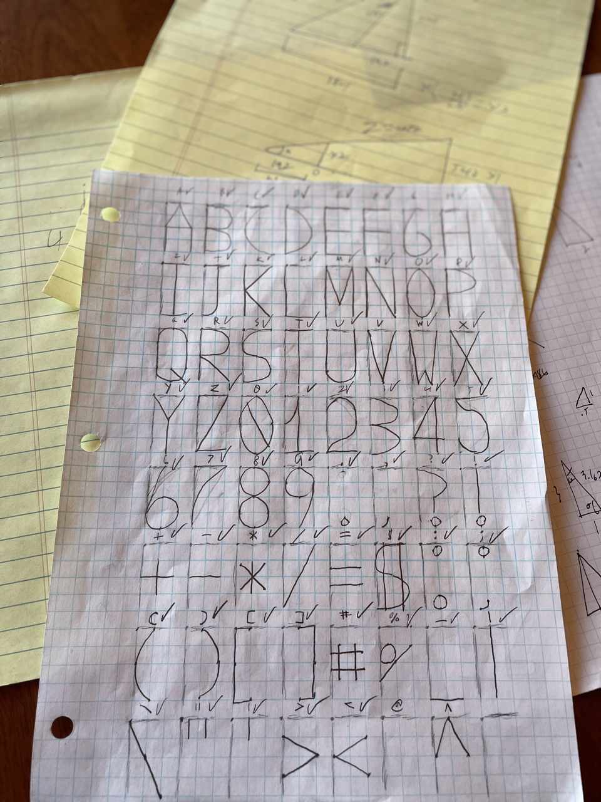
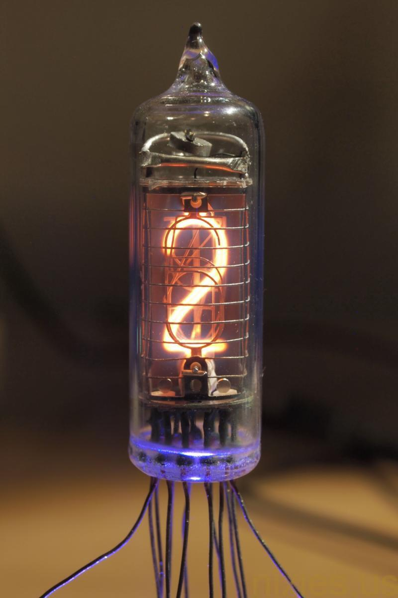
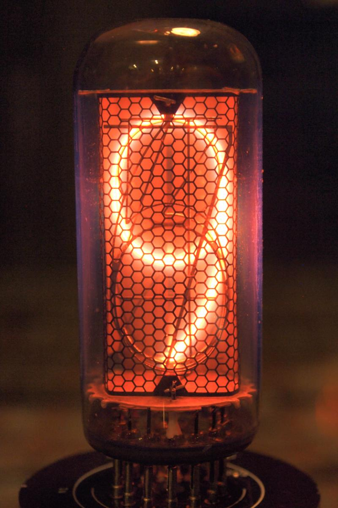

# BlotFont - Text for the Blot plotter

## What is this?
This is a library I created for my submission bid for a Hack Club "Blot", 2D pen plotter. It is a programatically usable plotter, meaning you can write code to move the pen to draw shapes and other objects.
In my case, I wanted an easy way to draw text- of which(as of writing), Blot's core code is unable to do. Enter BlotFont, a set of tools useful for converting pen movements and scaling them accordingly to how you wish to draw shapes, glyphs and other objects on the Blot.

When I created this, I also employed the TypeScript ecosystem for typechecking and extended library support; by cloning `blot.d.ts` to your own project, you can also enable Blot globals in your own project.

## How does it work?
BlotFont was created in 3 steps - drawing, converting and processing.
### Step 1 - Draw the shapes
For each of the letters Blot can write with, I first hand-graphed them out on graph paper in a 2x4 grid per each symbol:



### Step 2 - Convert the shapes
Each letter had to be converted into either instruction code, bezier curve, or both- this painstakingly was done with each individual character on the sheet, which took me around a combined 4-5 hours over 2 days.

### Step 3 - Process the instructions
The instruction parser functions like a virtual Blot- it processes inputs the same way as tossing it functions, which is more or less what is occuring. The converted instruction code is now easily understood by the plotter, which allows it to draw the previously graphed lines, curves and shapes.
```js
// Instructions for "p":
// [sa$90,f$4,r$90,f$1,arc$180,1,f$1]
//      |
//      V

// Internally, this is what is occuring:
const turtle = createTurtle()
turtle.setAngle(90)
turtle.forward(4)
turtle.right(90)
turtle.forward(1)
turtle.arc(180,1)
turtle.forward(1)

// The drawing will be too small to see; the library asks for scaling as an argument when drawing.
drawTurtles([turtle]) 
```

## What did you use for the letter inspiration?
Many of the symbols, especially the numbers were based off of rare Nixie tubes, including the IN-18, IN-2, and GR10J. In traditional factor of budget saving measures, several of the letters and numbers(see 2 & 5) utilize the same instruction set with very slight modifications.

These photos are taken from [nixies.us](https://www.nixies.us/), which I have relied extensively upon for research of these wonderful amber illuminators.






## How can I use this library?
Install esbuild if you haven't already via `npm i -g esbuild` and edit `main.ts` to your preferences. There are two building methods when you want to run your code:
```sh
npm run build # for minified output
npm run build_nomin # for non-minified output
```
Afterwards, `build.js` will contain the source needed for running your program.

## Current Issues
- Some characters have issues and/or are missing instructions. (as of writing, @, & and ^ are currently missing)
- Building produces a "use strict" error in the console.
  > This can be solved by deleting the wrapper function esbuild provides when building by default.
